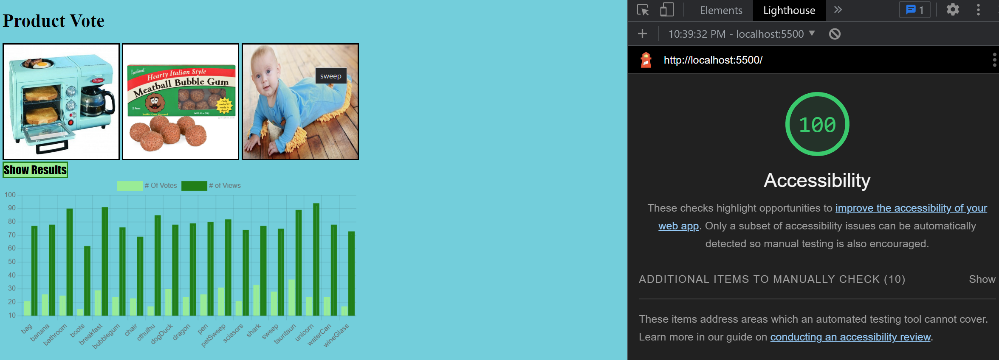

# odd-duck

In this project, three items are shown at a time. The user clicks on an image for a vote, and another set of images that are different from the previous ones show up. The user votes 25 times. In the end, a button is clicked to show the results of votes and total times an image showed up, in a visual chart. When the page is refreshed the votes and views still accrue from the previous sessions.